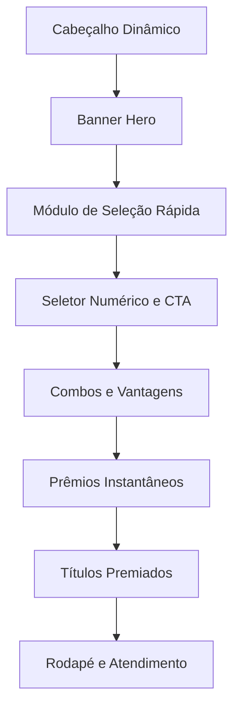

# Especificação de Projeto: Site de Rifas Premium (MegaRifas)

Este documento contém a especificação conceitual completa, arquitetura de informação e guia de UI/UX para o desenvolvimento de uma plataforma de rifas de alta conversão, otimizada para dispositivos móveis (Mobile-First).

---

## 🎨 1. Identidade Visual & Temas

### Modo Dark (Padrão)
- **Fundo:** Tons de grafite escuro/neutral escuro (`#0F1215` / `#181F25`)
- **Texto:** Branco puro e cinza claro para excelente legibilidade.
- **Objetivo:** O fundo escuro serve para dar destaque às fotos em alta resolução dos prêmios e iluminar os elementos de conversão (CTA).

### Modo Light
- **Fundo:** Tons de cinza claro sutil (`#F8FAFC` / `#FFFFFF`)
- **Texto:** Azul escuro/grafite (`#0F172A`) para alto contraste e fácil leitura sob a luz do dia.

### Cores de Ação (Gatilhos)
- **Verde Sucesso/PIX (`#108400`):** Utilizado estritamente para botões de compra, seleção ativa e status "Disponível".
- **Dourado/Âmbar (`#F59E0B`):** Reservado para destaques de premiação, troféus e títulos promocionais.
- **Cinza Neutro (`#6C757D`):** Para elementos secundários, bordas gerais ou itens já vendidos/contemplados.

---

## 🏗️ 2. Estrutura de Páginas e Seções (Fluxo de Cima para Baixo)

### A. Cabeçalho Dinâmico (Header)
- Logotipo estilizado alinhado à esquerda.
- Botão de alternar tema (Claro/Escuro) à direita.
- Botão rápido **"Meus Números / Consultar Compras"** permitindo consulta imediata inserindo o telefone (sem necessidade de login/senha).

### B. Banner Hero (O Prêmio Principal)
- Área centralizada para exibir a foto do prêmio principal (Ex: *Moto Titan 160cc 0KM*).
- Título da edição e preço unitário proeminente (**"Por apenas R$ 0,10"**).
- Barra de progresso real da campanha (Ex: *"72% dos títulos vendidos"*) com preenchimento colorido para gerar senso de progresso.

### C. Módulo de Seleção Rápida de Cotas
- **Grade (Grid 3x2):** Botões grandes e fáceis de tocar contendo pacotes rápidos de bilhetes: `+100`, `+200`, `+300`, `+400`, `+500`, `+1000`.
- O pacote mais recomendado (Ex: `+200`) deve vir com o selo **"Mais Popular"** integrado.

### D. Seletor Numérico e Botão de Ação (CTA)
- Seletor manual de quantidade com botões de ajuste `[-]` e `[+]` grandes.
- **Botão Fixo "Quero Participar!":** Botão verde largo, ocupando a base da tela, atualizando dinamicamente o valor total em tempo real (Ex: *"Quero Participar! ... R$ 4,50"*).
- **Mensagem de Alerta:** Banner sutil de escassez caso restem poucas cotas (Ex: *"Restam apenas X títulos!"*).

### E. Seção de Combos e Vantagens (Roletas e Caixas)
- Cards organizados verticalmente que combinam compra de lotes a chances adicionais em prêmios instantâneos.
- *Exemplo:* Comprar 500 Títulos e receber chances extras em caixas ou roletas da campanha.

### F. Módulos de Prêmios Instantâneos (Abas de Roletas e Caixas)
- **Painel Colapsável (Sanfona):** Exibição compacta contendo os prêmios da edição.
- **Grid de Itens:**
  - *Disponível:* Indicador verde ativo (● Disponível).
  - *Ganho:* Card com opacidade reduzida, troféu em destaque e nome do ganhador visível (🏆 Renan).

### G. Grid de Títulos Premiados (Achou, Ganhou!)
- Listagem elegante exibindo: Número da cota premiada, valor do prêmio associado e nome do respectivo ganhador.

### H. Rodapé e Suporte Rápido
- Termos de uso, regulamento baseado na Loteria Federal e redes sociais integradas.
- **Botão Flutuante de Suporte:** Ícone do WhatsApp fixado no canto inferior direito para contato direto e suporte a vendas.

---

## 💳 3. Experiência do Usuário no Checkout (Fluxo em 3 Etapas)

O checkout funciona em um painel que desliza de baixo para cima (*BottomSheet*) sem trocar de página, otimizando a conversão:

| Etapa | Ação | Descrição |
|---|---|---|
| **Etapa 1** | **Verificação** | Exibe o resumo do pedido e solicita o **Telefone** do comprador. |
| **Etapa 2** | **Cadastro Condicional** | Se o telefone for novo, solicita **Nome Completo** e confirmação rápida. |
| **Etapa 3** | **Pagamento** | Apresenta o código **PIX Copia e Cola** com botão de cópia fácil e timer regressivo de 10 minutos. |

---

> [!TIP]
> **Dica para Design no Figma:** Mantenha os botões de seleção de títulos e de checkout sempre com tamanho de toque mínimo de `48px` de altura para garantir a perfeita usabilidade com o polegar.
